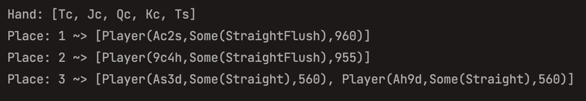

## Texas Holdem poker hand evaluator

### how to run: scala Main.scala [game-name] [hand] [player1] [player2] .. [playerN]
### how to run: scala Main.scala texas-holdem TcJcQcKcTs Ac2s As3d Ah9d 9c4h

## Let's say we have 4 players with the following cards:

**Player 1 - Ac2s (Ace of clubs and Two of spades)**

**Player 2 - As3d (Ace of spades and Three of diamonds)** 

**Player 3 - Ah9d (Ace of hearts and Nine of diamonds)**

**Player 4 - 9c4h (Nine of clubs and Four of hearts)**

## The app will run the hand and sort the players based on their scores

## The output:

